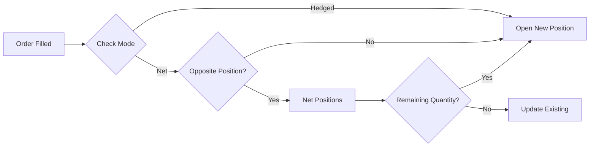

# Portfolio, Positions & History System

## Overview

Complete portfolio management system with position tracking, dashboard endpoints, and performance analytics.

## Components

### 1. Position Service (`services/position_service.py`)

Handles position lifecycle and operations in both **Net** and **Hedged** modes.

#### Position Modes

**Net Mode** (default):
- Single position per instrument
- Opposite orders automatically net out
- Example: LONG 1.0, then SHORT 0.5 → LONG 0.5

**Hedged Mode**:
- Separate long and short positions allowed
- Can hedge existing positions
- Example: LONG 1.0 and SHORT 0.5 exist simultaneously

#### Operations

**Add to Position**:
```python
from app.services.position_service import get_position_service, PositionMode

service = get_position_service(PositionMode.NET)

position = await service.add_to_position(
    account=account,
    instrument_id=instrument.id,
    side="LONG",
    quantity=1.0,
    price=1.1000,
    leverage=10.0,
    db=db
)
```

**Partial Close**:
```python
pnl = await service.partial_close(
    position=position,
    close_quantity=0.5,
    close_price=1.1100,
    db=db
)
```

**Reverse Position**:
```python
new_pos = await service.reverse_position(
    position=long_position,
    new_quantity=1.5,
    reverse_price=1.1050,
    db=db
)
```

**Hedge Position** (hedged mode only):
```python
service = get_position_service(PositionMode.HEDGED)

hedge = await service.hedge_position(
    account=account,
    instrument_id=instrument.id,
    quantity=0.5,
    price=1.1050,
    leverage=10.0,
    db=db
)
```

### 2. Portfolio API (`api/portfolio.py`)

REST endpoints for portfolio dashboard and management.

#### GET `/api/v1/portfolio/summary`

Portfolio overview with balance, equity, margin, and P&L.

**Response**:
```json
{
  "account_id": 123,
  "balance": 10000.00,
  "equity": 10500.50,
  "used_margin": 1000.00,
  "free_margin": 9500.50,
  "margin_level": 1050.05,
  "unrealized_pnl": 500.50,
  "realized_pnl_today": 125.75,
  "open_positions": 3,
  "total_exposure": 100000.00,
  "available_leverage": 100.0
}
```

#### GET `/api/v1/portfolio/positions`

List all open positions with details.

**Query Parameters**:
- `include_closed` (bool): Include closed positions

**Response**:
```json
[
  {
    "id": "uuid",
    "instrument_id": "uuid",
    "instrument_symbol": "EUR/USD",
    "side": "LONG",
    "quantity": 1.5,
    "entry_price": 1.1000,
    "current_price": 1.1050,
    "unrealized_pnl": 75.00,
    "pnl_percent": 0.45,
    "margin_used": 165.00,
    "leverage_used": 10.0,
    "swap_accumulated": -5.50,
    "opened_at": "2024-01-15T10:30:00Z"
  }
]
```

#### GET `/api/v1/portfolio/performance`

Performance metrics for specified period.

**Query Parameters**:
- `period`: "24h", "7d", "30d", "all"

**Response**:
```json
{
  "period": "30d",
  "total_pnl": 1250.75,
  "total_trades": 45,
  "win_rate": 62.5,
  "profit_factor": 1.85,
  "avg_win": 75.50,
  "avg_loss": -45.25,
  "largest_win": 250.00,
  "largest_loss": -125.50,
  "sharpe_ratio": 1.45,
  "max_drawdown": -350.00
}
```

#### GET `/api/v1/portfolio/history`

Portfolio value history over time.

**Query Parameters**:
- `period`: "24h", "7d", "30d"
- `resolution`: "5m", "15m", "1h", "4h", "1d"

**Response**:
```json
[
  {
    "timestamp": "2024-01-15T10:00:00Z",
    "equity": 10500.00,
    "balance": 10000.00,
    "unrealized_pnl": 500.00
  }
]
```

#### GET `/api/v1/portfolio/exposure`

Exposure breakdown by instrument and asset class.

**Response**:
```json
{
  "total_exposure": 250000.00,
  "by_instrument": {
    "EUR/USD": {
      "positions": 2,
      "total_quantity": 2.5,
      "exposure": 137500.00,
      "unrealized_pnl": 325.50
    }
  },
  "by_side": {
    "long": 5,
    "short": 2
  },
  "leverage_utilization": 24.5
}
```

#### GET `/api/v1/portfolio/alerts`

Active portfolio alerts (margin calls, risk warnings).

**Response**:
```json
{
  "alerts": [
    {
      "type": "margin_warning",
      "severity": "high",
      "message": "Margin level at 95.5%",
      "timestamp": "2024-01-15T10:30:00Z"
    }
  ]
}
```

## Position Lifecycle

### 1. Opening Position



### 2. Adding to Position

- Calculates new VWAP entry price
- Increases margin usage
- Maintains position tracking

**VWAP Calculation**:
```
New Entry Price = (Old Notional + New Notional) / Total Quantity
Old Notional = Quantity × Entry Price
New Notional = Additional Quantity × Current Price
```

### 3. Netting (Net Mode)

**Same Side**: Adds to position with VWAP

**Opposite Side**:
- If new < existing: Partial close existing
- If new = existing: Close existing
- If new > existing: Close existing, open new with remainder

### 4. Closing Position

**Full Close**:
- Calculates realized P&L
- Releases margin
- Updates account balance
- Marks position as closed

**Partial Close**:
- Proportional P&L calculation
- Proportional margin release
- Position remains open with reduced quantity

## Integration with Other Systems

### Margin Service

Position service delegates margin calculations:
```python
# Open position with margin check
position = await margin_service.open_position(
    account, instrument_id, side, quantity, price, leverage, db
)

# Close position releases margin
pnl = await margin_service.close_position(position, close_price, db)
```

### P&L Service

Calculates position P&L:
```python
pnl, pct_return = await pnl_service.calculate_position_pnl(
    position, current_price
)
```

### Pricing Service

Updates position with current prices:
```python
await position_service.update_position_prices(account_id, db)
```

## Usage Examples

### Opening a Position

```python
from app.services.position_service import get_position_service, PositionMode

# Get service (net mode)
service = get_position_service(PositionMode.NET)

# Open long position
position = await service.add_to_position(
    account=account,
    instrument_id=instrument.id,
    side="LONG",
    quantity=1.0,
    price=1.1000,
    leverage=10.0,
    db=db
)

print(f"Opened {position.side} {position.quantity} @ {position.entry_price}")
```

### Adding to Existing Position

```python
# Add 0.5 lots to existing position
position = await service.add_to_position(
    account=account,
    instrument_id=instrument.id,
    side="LONG",
    quantity=0.5,
    price=1.1050,
    leverage=10.0,
    db=db
)

print(f"New quantity: {position.quantity}, VWAP: {position.entry_price}")
```

### Partial Close

```python
# Close 0.3 lots at profit
pnl = await service.partial_close(
    position=position,
    close_quantity=0.3,
    close_price=1.1100,
    db=db
)

print(f"Realized P&L: ${pnl:.2f}")
print(f"Remaining quantity: {position.quantity}")
```

### Hedging (Hedged Mode)

```python
# Switch to hedged mode
service = get_position_service(PositionMode.HEDGED)

# Open long position
long_pos = await service.add_to_position(
    account, instrument.id, "LONG", 1.0, 1.1000, 10.0, db
)

# Hedge with short position
short_pos = await service.hedge_position(
    account, instrument.id, 0.5, 1.1050, 10.0, db
)

print(f"Long: {long_pos.quantity}, Short: {short_pos.quantity}")
```

### Reversing Position

```python
# Close long and open short
new_pos = await service.reverse_position(
    position=long_position,
    new_quantity=1.5,
    reverse_price=1.1050,
    db=db
)

print(f"Reversed to {new_pos.side} {new_pos.quantity}")
```

### Portfolio Summary

```python
summary = await service.get_position_summary(account.id, db)

print(f"Open positions: {summary['open_positions']}")
print(f"Total exposure: ${summary['total_exposure']:.2f}")
print(f"Unrealized P&L: ${summary['total_unrealized_pnl']:.2f}")
print(f"Long: {summary['by_side']['long']}, Short: {summary['by_side']['short']}")
```

## API Usage Examples

### Get Portfolio Summary

```bash
curl -X GET "http://localhost:8000/api/v1/portfolio/summary" \
  -H "Authorization: Bearer <token>"
```

### Get All Positions

```bash
curl -X GET "http://localhost:8000/api/v1/portfolio/positions" \
  -H "Authorization: Bearer <token>"
```

### Get Performance Metrics

```bash
curl -X GET "http://localhost:8000/api/v1/portfolio/performance?period=30d" \
  -H "Authorization: Bearer <token>"
```

### Get Portfolio History

```bash
curl -X GET "http://localhost:8000/api/v1/portfolio/history?period=7d&resolution=1h" \
  -H "Authorization: Bearer <token>"
```

## Testing

Comprehensive test suite in `tests/test_position_service.py`:

```bash
pytest tests/test_position_service.py -v
```

Test coverage:
- ✅ Open position in net mode
- ✅ Add to existing position (VWAP)
- ✅ Net opposite positions
- ✅ Exact netting (close position)
- ✅ Reverse position (net larger opposite)
- ✅ Hedged mode separate positions
- ✅ Hedge position
- ✅ Close position
- ✅ Partial close
- ✅ Reverse position
- ✅ Position summary
- ✅ Insufficient margin handling
- ✅ P&L calculation
- ✅ Hedging restriction in net mode

## Configuration

Position mode is set per service instance:

```python
# Net mode (default)
net_service = PositionService(mode=PositionMode.NET)

# Hedged mode
hedged_service = PositionService(mode=PositionMode.HEDGED)

# Or use singletons
net_service = get_position_service(PositionMode.NET)
hedged_service = get_position_service(PositionMode.HEDGED)
```

## Performance Considerations

### Position Updates

Batch position price updates:
```python
# Update all positions at once
await position_service.update_position_prices(account_id, db)
```

### Database Queries

Optimized queries with indexes on:
- `account_id` + `instrument_id` + `closed_at`
- `account_id` + `side` + `closed_at`

### Caching

Consider caching:
- Position summaries (5-10 second TTL)
- Performance metrics (1-minute TTL)
- Portfolio history (longer TTL)

## Future Enhancements

### Portfolio Snapshots

Save periodic snapshots for historical analysis:
```python
class PortfolioSnapshot(Base):
    timestamp = Column(DateTime, primary_key=True)
    account_id = Column(Integer, ForeignKey("accounts.id"))
    equity = Column(Float)
    balance = Column(Float)
    used_margin = Column(Float)
    open_positions = Column(Integer)
```

### Advanced Alerts

- Position size warnings
- Concentration risk alerts
- Unusual P&L movements
- Time-based position alerts

### Portfolio Optimizer

- Suggest position adjustments
- Risk/reward optimization
- Correlation analysis

### Real-time Updates

WebSocket push for portfolio changes:
```javascript
ws.onmessage = (event) => {
  const data = JSON.parse(event.data);
  if (data.type === 'portfolio_update') {
    updatePortfolioDashboard(data.summary);
  }
};
```

## Database Schema

### Position Table

```sql
CREATE TABLE positions (
    id UUID PRIMARY KEY,
    account_id INTEGER REFERENCES accounts(id),
    instrument_id UUID REFERENCES instruments(id),
    side VARCHAR(10) NOT NULL,  -- LONG/SHORT
    quantity FLOAT NOT NULL,
    entry_price FLOAT NOT NULL,
    current_price FLOAT,
    margin_used FLOAT NOT NULL,
    leverage_used FLOAT NOT NULL,
    unrealized_pnl FLOAT DEFAULT 0.0,
    realized_pnl FLOAT DEFAULT 0.0,
    swap_accumulated FLOAT DEFAULT 0.0,
    opened_at TIMESTAMP DEFAULT NOW(),
    closed_at TIMESTAMP,
    
    INDEX idx_account_instrument (account_id, instrument_id, closed_at),
    INDEX idx_account_side (account_id, side, closed_at)
);
```

## Error Handling

Position service handles:
- Insufficient margin
- Invalid quantities
- Closed positions
- Missing instruments
- Mode restrictions (hedging in net mode)

Example:
```python
try:
    position = await service.add_to_position(...)
except ValueError as e:
    if "Insufficient margin" in str(e):
        # Handle margin issue
    elif "Hedging only available" in str(e):
        # Handle mode restriction
```

## Logging

Position operations are logged:
```python
logger.info(f"Opened position {position.id}: {side} {quantity} @ {price}")
logger.info(f"Increased position {position.id}: +{quantity} @ {price}, VWAP: {new_entry}")
logger.info(f"Closed position {position.id}: P&L: {pnl:.2f}")
logger.info(f"Partial close: -{quantity} @ {price}, remaining: {remaining}")
logger.info(f"Reversed position: closed {old_side}, opened {new_side}")
```

## Conclusion

Complete portfolio management system with:
- ✅ Net and hedged position modes
- ✅ Position lifecycle operations
- ✅ Dashboard REST API
- ✅ Performance metrics
- ✅ Portfolio summaries
- ✅ Alerts and monitoring
- ✅ Comprehensive testing

Ready for integration with frontend dashboard and real-time updates.
